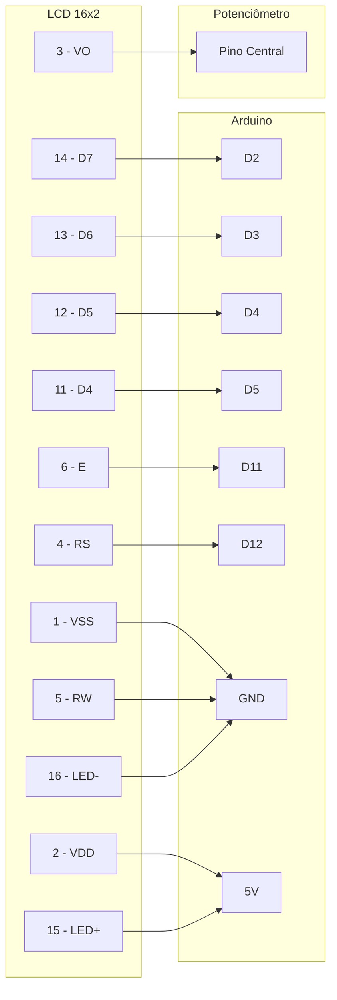
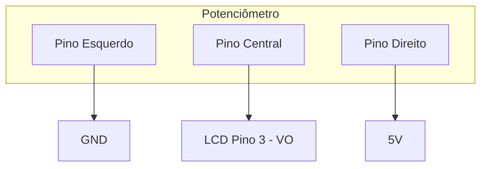
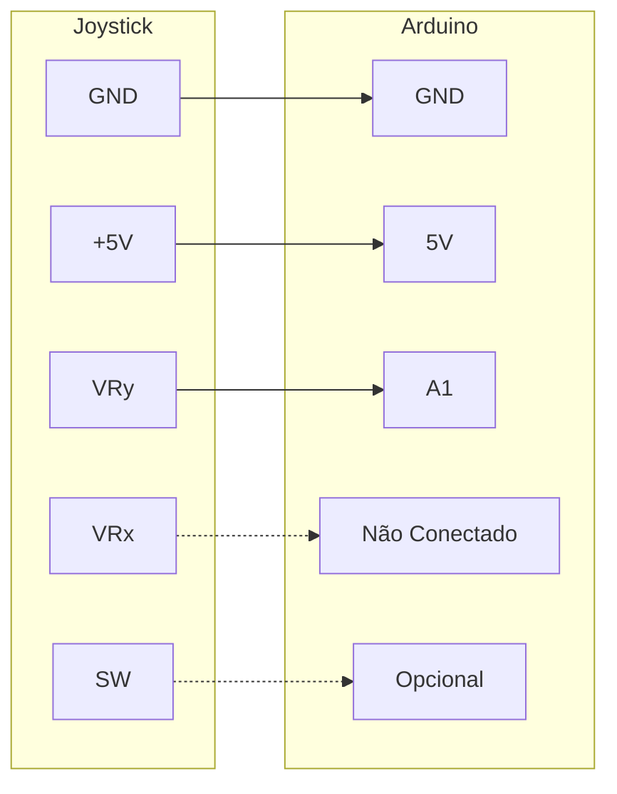

## Flappy LCD Game (Arduino + Joystick + LCD 16x2)

Um projeto simples para estudantes e entusiastas que estão aprendendo a utilizar o Arduino.

Este jogo é uma versão textual do Flappy Bird, utilizando um Arduino Uno, um joystick analógico e
um display LCD 16x2. Ideal para quem deseja praticar lógica, eletrônica básica e programação em C++ no Arduino.

## Objetivo

Desvie dos obstáculos utilizando o joystick para controlar a posição do personagem (>) no display LCD.

## Componentes

1x Arduino Uno
1x LCD 16x2
1x Joystick analógico
1x Potenciômetro 10kΩ
1x Resistor 220Ω (para o backlight do LCD)
1x Protoboard
Jumpers (cabos de conexão)

## Simulação no Tinkercad

Você pode simular este projeto no Tinkercad Circuits utilizando os seguintes nomes:

## Item Nome no Tinkercad

Arduino UNO Arduino Uno R3
LCD 16x2 LCD (16x2)
Potenciômetro 10kΩ Rotary Potentiometer
Joystick analógico Joystick
Resistor 220Ω Resistor
Protoboard Breadboard
Cabos Wire ou Breadboard wire

# 🔌 Conexões do Circuito

## 📱 LCD 16x2 com Potenciômetro

### 📋 Tabela de Conexões - LCD

| Pino LCD | Nome | Conexão |
|----------|------|---------|
| 1 | VSS | GND |
| 2 | VDD | 5V |
| 3 | VO | Pino central do potenciômetro |
| 4 | RS | Arduino D12 |
| 5 | RW | GND |
| 6 | E | Arduino D11 |
| 11 | D4 | Arduino D5 |
| 12 | D5 | Arduino D4 |
| 13 | D6 | Arduino D3 |
| 14 | D7 | Arduino D2 |
| 15 | LED+ | 5V (com resistor 220Ω) |
| 16 | LED- | GND |

---

## 🎛️ Potenciômetro (Contraste LCD)

### 📋 Tabela de Conexões - Potenciômetro

| Pino | Conexão |
|------|---------|
| Esquerdo | GND |
| Central | LCD Pino 3 (VO) |
| Direito | 5V |

---

## 🕹️ Joystick Analógico

### 📋 Tabela de Conexões - Joystick

| Pino Joystick | Conexão Arduino | Status |
|---------------|-----------------|--------|
| GND | GND | ✅ Conectado |
| +5V | 5V | ✅ Conectado |
| VRy | A1 | ✅ Conectado |
| VRx | - | ❌ Não utilizado |
| SW | - | ⚠️ Opcional |

---

## ⚡ Resumo das Conexões

### Alimentação
- **5V** → LCD VDD, LCD LED+, Potenciômetro (direito), Joystick +5V
- **GND** → LCD VSS, LCD RW, LCD LED-, Potenciômetro (esquerdo), Joystick GND

### Sinais Digitais
- **D2** → LCD D7
- **D3** → LCD D6  
- **D4** → LCD D5
- **D5** → LCD D4
- **D11** → LCD E (Enable)
- **D12** → LCD RS (Register Select)

### Sinais Analógicos
- **A1** → Joystick VRy (Eixo Y)

### Controle
- **Potenciômetro Central** → LCD VO (Contraste)

## Código

O código completo do jogo está no arquivo: lcd_flappy.ino

